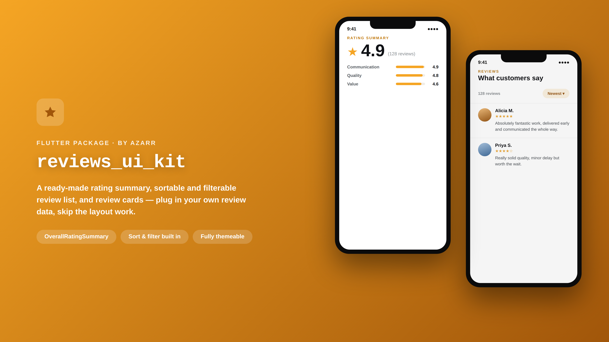
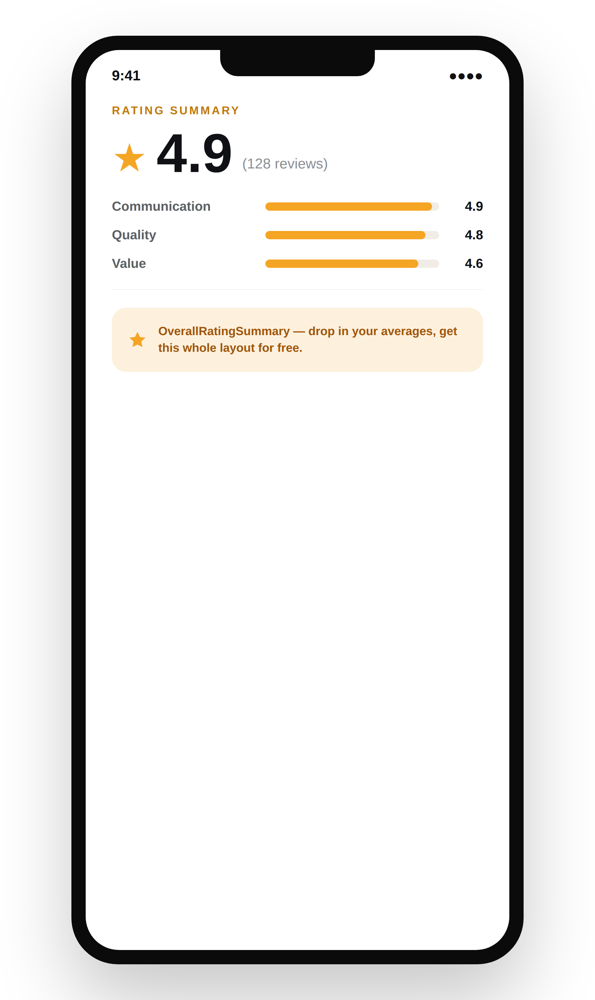
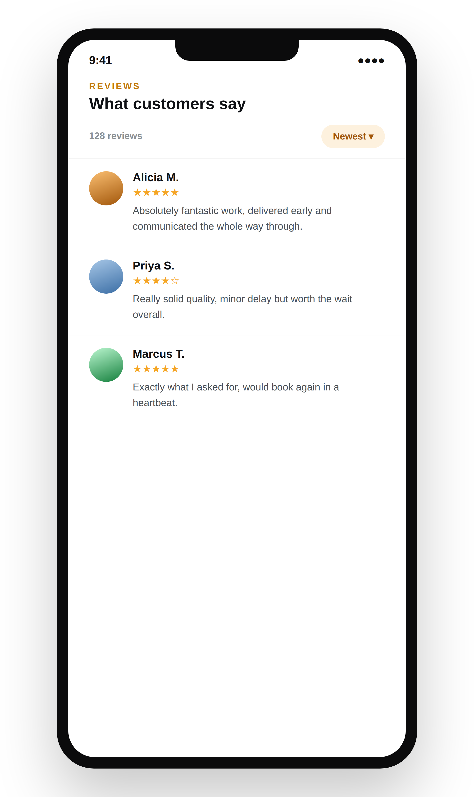

# reviews_ui_kit

<p align="center">
  
</p>

Ready-made rating summary, review list, review cards, and a star-picker
form for Flutter — so a "reviews" feature doesn't mean rebuilding the same
avatar-name-stars-text layout, sort sheet, and loading skeleton from
scratch every time.

Extracted and generalized from a production marketplace app's review
screens: nothing here assumes a particular model class, backend, or state
management approach — every widget takes plain data and callbacks.

<p align="center">
  
  &nbsp;&nbsp;
  
</p>

## Features

- `ReviewListItem` — a full review card: avatar, name, country, rating,
  relative date, review text (or a big decorative star row when there's no
  text), attachment thumbnails, and an optional seller-reply bubble.
- `OverallRatingSummary` — the big average-rating number plus an optional
  breakdown of named sub-ratings.
- `BigStarRating` — a standalone full/half/outline star row with an "x/5"
  label.
- `RatingRow` — one labeled row of 5 tappable stars, for a "rate your
  experience" form.
- `ReviewInputField` — a styled multi-line text field for writing or
  replying to a review.
- `ReviewSortOption` / `ReviewFilterSheet` — a 5-option sort enum and the
  bottom sheet that picks one.
- `ReferenceChip` — a small tappable card pointing at whatever's being
  reviewed (a listing, a service, a product).
- `ReviewListItemShimmer` / `ReviewLoadMoreShimmer` / `ReviewListShimmer` —
  loading-state skeletons matching `ReviewListItem`'s layout exactly.
- `InfoMessage` — a small icon + text banner for inline notices.
- Model-agnostic throughout: every widget takes a plain `ReviewData` (or
  primitives), never a specific class from your app.

## Install

```yaml
dependencies:
  reviews_ui_kit: ^0.1.0
```

## Usage

### The rating summary

```dart
import 'package:reviews_ui_kit/reviews_ui_kit.dart';

OverallRatingSummary(
  averageRating: 4.8,
  totalReviews: 128,
  subRatings: {
    'Communication': 4.9,
    'Quality': 4.8,
    'Value': 4.6,
  },
)
```

`subRatings` is optional — leave it out (or empty) to show just the
headline number with no breakdown.

### A review list

```dart
final reviews = <ReviewData>[
  ReviewData(
    customerName: 'Alicia M.',
    rating: 5,
    reviewText: 'Absolutely fantastic work, delivered early.',
    date: DateTime.now().subtract(const Duration(days: 2)),
    country: 'Jamaica',
    vendorReply: 'Thank you so much!',
  ),
  // ...
];

ListView(
  children: [for (final r in reviews) ReviewListItem(review: r)],
)
```

Map whatever your backend returns into `ReviewData` once — it's a plain,
immutable class with no ties to any model, ORM, or state package.

### Sorting

```dart
ReviewSortOption sort = ReviewSortOption.newest;

IconButton(
  icon: const Icon(Icons.sort),
  onPressed: () => ReviewFilterSheet.show(
    context,
    current: sort,
    onSelected: (opt) => setState(() => sort = opt),
  ),
)
```

`onSelected` just tells you which `ReviewSortOption` was picked — sort your
own list however you fetch/cache it.

### Writing a review

```dart
double? rating;
final controller = TextEditingController();

Column(
  children: [
    RatingRow(
      label: 'Overall rating',
      value: rating,
      onChanged: (v) => setState(() => rating = v),
    ),
    ReviewInputField(controller: controller, hintText: 'Write your review...'),
  ],
)
```

### Loading state

```dart
isLoading ? const ReviewListShimmer(count: 5) : reviewListView
```

### Formatting dates, countries, and attachments your own way

`ReviewListItem` ships with a sensible default for each, but takes
callbacks if you want to override them:

```dart
ReviewListItem(
  review: review,
  dateLabelBuilder: (date) => DateFormat.yMMMd().format(date), // use intl
  flagBuilder: (country) => countryFlagEmoji(country),
  attachmentBuilder: (context, url, allUrls, index) => GestureDetector(
    onTap: () => openYourOwnGallery(allUrls, index),
    child: YourMediaThumbnail(url: url),
  ),
)
```

The default attachment renderer shows a plain network image with no tap
action — pass `attachmentBuilder` for anything richer (a full-screen
viewer, video/audio/PDF-aware thumbnails, etc).

## Why a plain `ReviewData` instead of a generic type parameter

Review widgets almost always need the same handful of fields — name,
avatar, rating, text, date, attachments, a reply — so a small, explicit
data class is simpler to map into than a `ReviewListItem<T>` with a dozen
field-extractor callbacks. If your model already looks like this, mapping
is a one-line `.toReviewData()` extension.

## License

MIT — see `LICENSE`.
